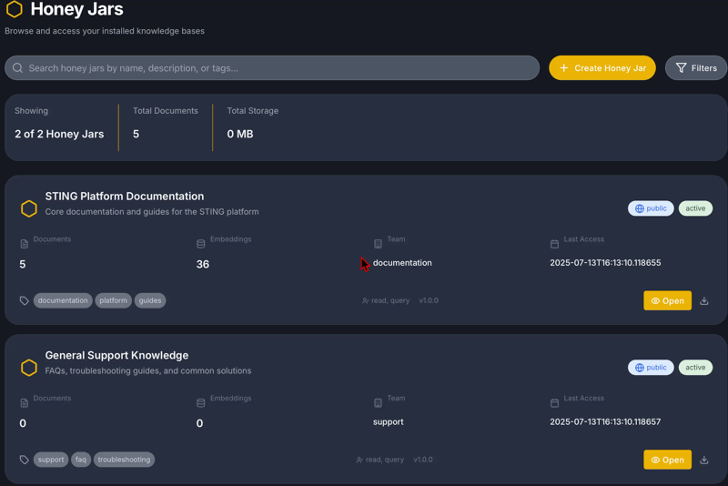
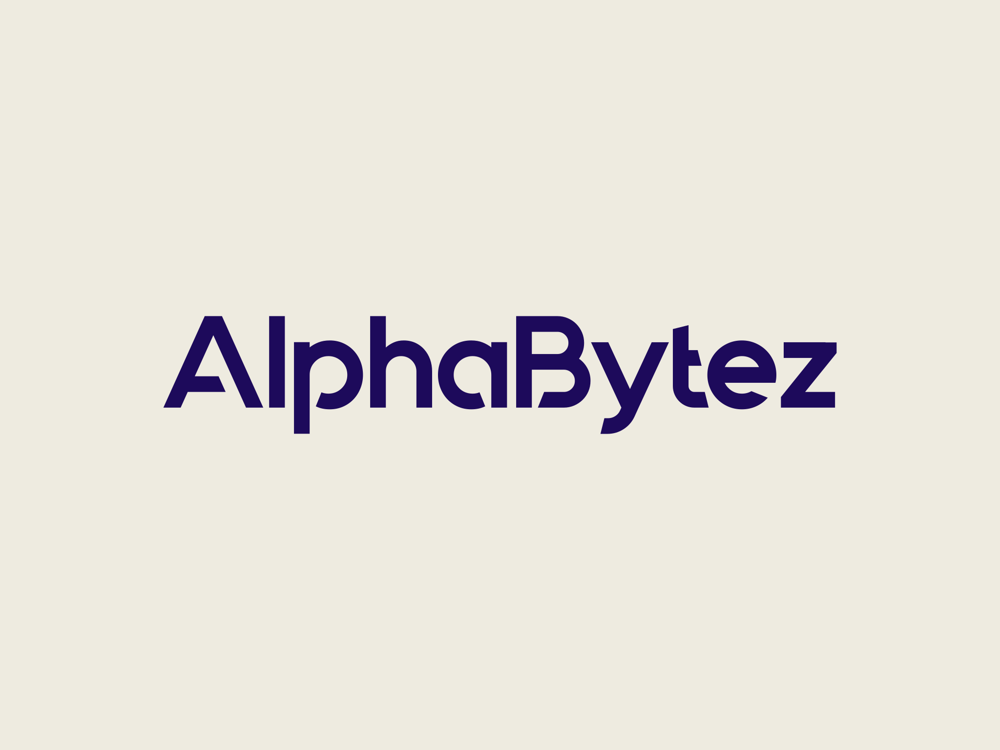

# STING CE (Community Edition)

> **Secure Trusted Intelligence and Networking Guardian**
>
> Developed by [AlphaBytez](https://github.com/alphabytez)
>
> *Bee Smart. Bee Secure.*

[](https://opensource.org/licenses/Apache-2.0)
[](https://www.docker.com/)
[](https://www.python.org/)
[](https://github.com/alphabytez)

**Your data. Your AI. Your rules.**

STING-CE is for teams and organizations who want to run AI on their own terms. No cloud dependencies, no data leaving your servers, no third-party snooping. You get a complete AI-powered knowledge platform that runs entirely on your infrastructure.

Think of it as your private ChatGPT—but one that actually knows your company's documents, respects your privacy policies, and doesn't phone home. Store your knowledge in "Honey Jars," chat with Bee (our AI assistant), and keep everything locked down with enterprise-grade security.

<p align="center">
  
</p>

## What Can STING-CE Do?

### Honey Jars: Your Knowledge, Organized

Honey Jars are where your documents live. Drop in PDFs, Word docs, markdown files, or plain text—STING automatically processes them, breaks them into searchable chunks, and creates vector embeddings. When you (or Bee) ask a question, the system finds the most relevant pieces of your knowledge instantly.

- Supports PDF, DOCX, HTML, JSON, Markdown, and TXT
- Semantic search that understands meaning, not just keywords
- Everything stays on your servers

<p align="center">
  
</p>

### Bee: Your AI Assistant That Actually Knows Your Stuff

Bee (B. Sting, if we're being formal) is your conversational AI that's connected to your Honey Jars. Ask questions in plain English, and Bee pulls relevant context from your documents before generating responses. It's like having a colleague who's read everything and remembers it perfectly.

- Natural conversation with your knowledge base
- Works with Ollama (local), OpenAI, LM Studio, or vLLM
- Answers grounded in your actual documents

<p align="center">
  
</p>

### Security That Doesn't Get in the Way

We built STING-CE for organizations that take security seriously. Passwordless login with passkeys, multi-factor auth, automatic PII detection, and HashiCorp Vault for secrets. All traffic encrypted, all services isolated, all access logged.

- Passwordless auth with WebAuthn/passkeys and magic links
- MFA options: TOTP, SMS, biometrics
- Automatic PII detection and protection
- Zero-trust architecture throughout

### Modern Interface, Easy Setup

One command gets you up and running. A web wizard walks you through configuration. The interface is clean, responsive, and works on any device. Pick from multiple themes (including a slick glass morphism design) and dark mode support.

- Docker-based: `bash bootstrap.sh` and you're off
- Web setup wizard for painless configuration
- Themes for every taste, accessibility baked in

## Heads Up: This Is a Work in Progress

STING-CE is under active development. The core platform works and you can deploy it today, but some features are still being polished. You might hit rough edges, and some things may need extra configuration to work perfectly.

**We'd love your help making it better:**

- Found something broken? [Open an issue](https://github.com/AlphaBytez/STING-CE-Public/issues)
- Got an idea? [Tell us about it](https://github.com/AlphaBytez/STING-CE-Public/issues/new)
- Want to contribute code? [Check out CONTRIBUTING.md](CONTRIBUTING.md)
- Docs person? Documentation PRs are especially welcome

This is a community project. Whether you're fixing typos or building features, every contribution helps.

## Getting Started

### What You'll Need

- **A Linux box** (Ubuntu 20.04+, Debian 11+), macOS, or WSL2
- **8GB RAM** minimum (16GB is better, especially for running local LLMs)
- **4 CPU cores**
- **50GB disk space**
- Docker (we'll install it if you don't have it)

### The Easy Way (One Command)

```bash
bash -c "$(curl -fsSL https://raw.githubusercontent.com/AlphaBytez/STING-CE-Public/main/bootstrap.sh)"
```

That's it. The script detects your platform, clones the repo, and fires up a web wizard to walk you through the rest.

### The Manual Way

If you prefer to see what's happening:

```bash
git clone https://github.com/AlphaBytez/STING-CE-Public.git
cd STING-CE-Public
./install_sting.sh
```

The installer handles everything: checking your system, installing Docker if needed, launching a setup wizard at `http://localhost:8335`, and getting all 20+ services running. You'll configure your domain, email settings, and LLM preferences through the web interface.

**Once it's done:**
- Open https://localhost:8443 for the main interface
- API lives at https://localhost:5050
- Dev email viewer at http://localhost:8025 (Mailpit)

### Already Installed? Upgrading Is Easy

```bash
cd STING-CE-Public
./manage_sting.sh reinstall          # Keeps your data
./manage_sting.sh reinstall --fresh  # Nuclear option: wipes everything
```

### Headless/Automated Install

For servers without a GUI or CI/CD pipelines:

```bash
git clone https://github.com/AlphaBytez/STING-CE-Public.git
cd STING-CE-Public
cp STING/conf/config.yml.default STING/conf/config.yml
nano STING/conf/config.yml  # Set your domain, email, etc.
./install_sting.sh --non-interactive
./manage_sting.sh start
```

## Documentation

**Online docs**: [docs.sting.alphabytez.dev](https://alphabytez.github.io/sting-docs/) (coming soon) — searchable, mobile-friendly, dark mode included.

**In the repo**: Everything's in `STING/docs/`:
- [Installation Guide](STING/docs/platform/guides/fresh-install-guide.md)
- [Configuration](STING/docs/operations/)
- [API Reference](STING/docs/api/)
- [Architecture Deep Dive](STING/docs/architecture/)
- [Security Policies](SECURITY.md)

## Day-to-Day Management

```bash
./manage_sting.sh start              # Fire up all services
./manage_sting.sh stop               # Shut everything down
./manage_sting.sh restart [service]  # Restart one service (or all)
./manage_sting.sh logs [service]     # Tail the logs
./manage_sting.sh status             # See what's running
```

### Setting Up Passkeys Across Machines

If you're using WebAuthn/passkeys (and you should—they're great), you'll need to distribute your CA certificate to client machines. Otherwise browsers will complain about self-signed certs and passkeys won't work.

```bash
./manage_sting.sh export-certs ./client-certs
./manage_sting.sh copy-certs user@hostname /remote/path
```

Then on each client:
- **macOS**: `./install-ca-mac.sh`
- **Linux**: `./install-ca-linux.sh`
- **Windows**: `install-ca-windows.ps1`

More details in the [Certificate Management Guide](STING/docs/guides/CERTIFICATE_MANAGEMENT.md).

## Under the Hood

STING-CE runs as a fleet of Docker containers working together:

| Service | What It Does |
|---------|-------------|
| **Frontend** | React + Vite UI |
| **API** | Flask backend with automatic PII protection |
| **Kratos** | Ory Kratos handles all the auth stuff |
| **Vault** | HashiCorp Vault keeps secrets secret |
| **Bee** | The AI chatbot that knows your docs |
| **Knowledge** | ChromaDB vector store for semantic search |
| **Database** | PostgreSQL for structured data |
| **Redis** | Caching and sessions |
| **Mailpit** | Catches emails in dev mode |

Everything communicates over an internal Docker network with Nginx handling SSL termination and routing.

## When Things Go Wrong

**Emails not sending?**
```bash
python3 STING/scripts/health/validate_mailpit.py
```

**"Permission denied" from Docker?**
```bash
sudo usermod -aG docker $USER
# Then log out and back in
```

**Port 8443 already in use?**
```bash
sudo lsof -i :8443  # Find the culprit
# Either kill it or change the port in config.yml
```

**Services won't start?**
```bash
./manage_sting.sh logs           # What's the error?
free -h && df -h                 # Out of RAM or disk?
./manage_sting.sh restart        # Sometimes a restart fixes it
```

## Contributing

Want to help? Awesome. Check out [CONTRIBUTING.md](CONTRIBUTING.md) for how to get started.

## Security

Found a security issue? **Don't open a public issue.** Instead, read [SECURITY.md](SECURITY.md) for our responsible disclosure process. We take security seriously and will respond quickly.

## License

[Apache License 2.0](LICENSE) — use it, modify it, share it. Just keep the license notice.

## Who Made This?

STING-CE is built by **[AlphaBytez](https://github.com/AlphaBytez)**, a team focused on security, authentication, and AI.

- Questions? [olliec@alphabytez.dev](mailto:olliec@alphabytez.dev)
- Security concerns? [security@alphabytez.dev](mailto:security@alphabytez.dev)

## Standing on the Shoulders of Giants

STING-CE wouldn't exist without these amazing open-source projects:

**Infrastructure**: [Ory Kratos](https://www.ory.sh/kratos/) (auth), [HashiCorp Vault](https://www.vaultproject.io/) (secrets), [PostgreSQL](https://www.postgresql.org/), [Redis](https://redis.io/), [Docker](https://www.docker.com/)

**AI/ML**: [Ollama](https://ollama.ai/), [ChromaDB](https://www.trychroma.com/), [Sentence Transformers](https://www.sbert.net/)

**Frameworks**: [Flask](https://flask.palletsprojects.com/), [FastAPI](https://fastapi.tiangolo.com/), [React](https://react.dev/), [Vite](https://vitejs.dev/)

**Dev Tools**: [Mailpit](https://github.com/axllent/mailpit), [Grafana](https://grafana.com/), [Loki](https://grafana.com/oss/loki/)

Special thanks to the Ory, ChromaDB, and Ollama communities for making secure, private AI accessible to everyone.

Full credits in [CREDITS.md](CREDITS.md).

---

<div align="center">

**Version 1.0.0-ce** · [Changelog](CHANGELOG.md) · Active Development

Linux (Ubuntu/Debian) · macOS · WSL2 · Python 3.11+ · React

<br/>

<a href="https://github.com/alphabytez">
  
</a>

<br/>

*Bee Smart. Bee Secure.*

```bash
bash -c "$(curl -fsSL https://raw.githubusercontent.com/AlphaBytez/STING-CE-Public/main/bootstrap.sh)"
```

</div>
