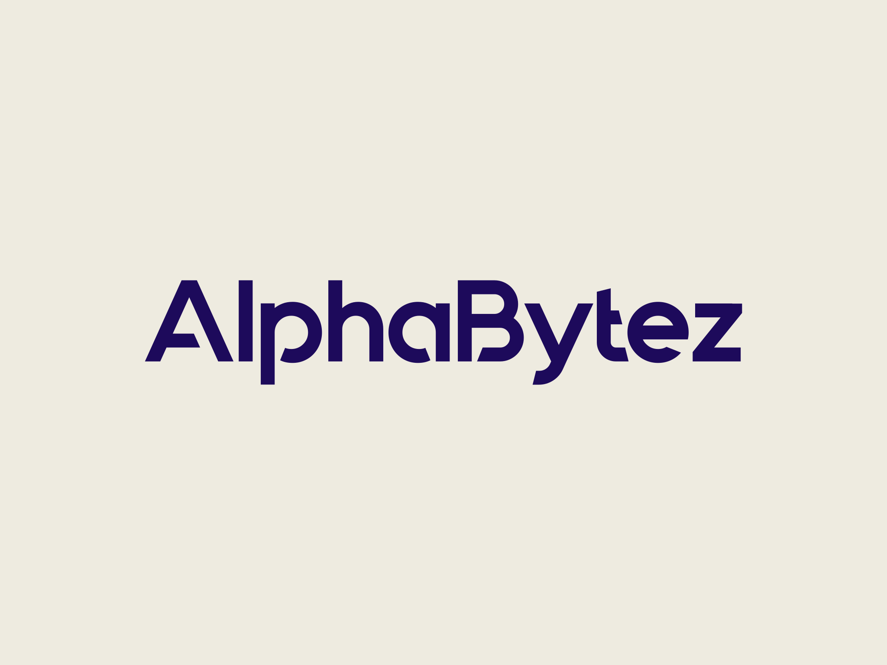

# STING-CE Documentation

<div align="center">
  
  <br/>
  <p><i>Secure Trusted Intelligence and Networking Guardian</i></p>
  <p><strong>Bee Smart. Bee Secure.</strong></p>
</div>

---

## 📚 Welcome to STING-CE Documentation

This documentation directory contains comprehensive guides for installing, configuring, operating, and developing with STING-CE.

**For the main project overview, see the [project README](../../README.md).**

> **Note:** STING-CE is under active development. Not all features are fully implemented or production-ready. We welcome [bug reports](https://github.com/AlphaBytez/STING-CE/issues), [feature requests](https://github.com/AlphaBytez/STING-CE/issues/new), and [contributions](../../CONTRIBUTING.md) from the community!

## 🚀 Quick Start

If you're new to STING-CE, start here:

1. **[Installation Guide](../INSTALL.md)** - Get STING-CE up and running
2. **[Quick Start](../../README.md#-quick-start)** - One-line installation command
3. **[Configuration Guide](operations/)** - Configure STING-CE for your environment

## 📖 Documentation Structure

### Installation & Setup
- **[INSTALL.md](../INSTALL.md)** - Detailed installation instructions
- **[Operations Guides](operations/)** - Service management and configuration
- **[Platform Compatibility](PLATFORM_COMPATIBILITY_GUIDE.md)** - macOS, WSL, and Linux support

### Features & Capabilities
- **[Honey Jar System](features/HONEY_JAR_TECHNICAL_REFERENCE.md)** - Knowledge management with vector search
- **[Passwordless Authentication](features/PASSWORDLESS_AUTHENTICATION.md)** - WebAuthn and magic links
- **[PII Detection](features/PII_DETECTION_SYSTEM.md)** - Automatic sensitive data protection
- **[Bee Chat](features/BEE_CHAT_MESSAGING_ARCHITECTURE.md)** - AI assistant with context awareness

### Architecture & Development
- **[System Architecture](architecture/system-architecture.md)** - Overall system design
- **[Technical Architecture](architecture/technical-architecture.md)** - Implementation details
- **[API Documentation](api/)** - REST API reference
- **[CLAUDE.md](CLAUDE.md)** - Developer guide for working with the codebase

### Guides
- **[AI Assistant Setup](guides/AI_ASSISTANT.md)** - Configure Bee with Ollama
- **[Ollama Setup](guides/OLLAMA_SETUP_GUIDE.md)** - Local LLM deployment
- **[Passkey Quickstart](guides/PASSKEY_QUICKSTART.md)** - WebAuthn setup
- **[Honey Jar User Guide](features/HONEY_JAR_USER_GUIDE.md)** - Knowledge base management

## 🏗️ Architecture Overview

STING-CE is built on a microservices architecture with complete data sovereignty:

```
┌─────────────┐     ┌────────────┐     ┌───────────────┐
│   Frontend  │────▶│  Backend   │────▶│      Bee      │
│   (React)   │     │  (Flask)   │     │  (Chatbot)    │
└─────────────┘     └────────────┘     └───────┬───────┘
       │                   │                    │
       │                   │                    ▼
       │                   │           ┌────────────────┐
       │                   │           │   Knowledge    │
       │                   │           │  (ChromaDB)    │
       ▼                   ▼           └────────────────┘
┌─────────────┐     ┌────────────┐
│   Kratos    │     │  Database  │     ┌────────────────┐
│   (Auth)    │     │(PostgreSQL)│     │     Vault      │
└─────────────┘     └────────────┘     │   (Secrets)    │
                                       └────────────────┘
       │                   │                    │
       └───────────────────┴────────────────────┘
                           │
                    ┌──────▼──────┐
                    │   Ollama    │
                    │   (LLMs)    │
                    └─────────────┘
```

### Core Components

**Frontend (Port 8443)**
- React-based UI with Material-UI
- Passwordless authentication flows
- Honey Jar knowledge management interface
- Real-time chat with Bee

**Backend API (Port 5050)**
- Flask REST API
- PII detection and serialization
- Session management with AAL2 support
- Audit logging

**Authentication (Ports 4433/4434)**
- Ory Kratos for identity management
- WebAuthn/Passkeys support
- Magic link authentication
- Multi-factor authentication (TOTP)

**AI & Knowledge**
- Bee chatbot service (Port 8888)
- Knowledge service with ChromaDB (Port 8090)
- Ollama for LLM deployment (Port 11434)
- Vector embeddings with Sentence Transformers

**Infrastructure**
- PostgreSQL databases (separate for app, Kratos, messaging)
- HashiCorp Vault for secrets
- Redis for caching and sessions
- Mailpit for development email testing

## 🛠️ Common Operations

### Service Management

```bash
# From repository root
./manage_sting.sh start          # Start all services
./manage_sting.sh stop           # Stop all services
./manage_sting.sh restart        # Restart all services
./manage_sting.sh status         # Check service health
./manage_sting.sh logs [service] # View service logs
```

### Configuration

All configuration is managed through `STING/conf/config.yml`:

```yaml
system:
  domain: localhost
  protocol: https

email:
  mode: development  # or 'production'

llm:
  provider: ollama
  base_url: http://localhost:11434
  default_model: phi3:mini
```

After editing configuration:
```bash
./manage_sting.sh restart
```

### Accessing Services

- **Frontend**: https://localhost:8443
- **API**: https://localhost:5050
- **Mailpit** (dev): http://localhost:8025
- **Vault UI**: http://localhost:8200
- **Grafana** (if enabled): http://localhost:3001

## 📊 Key Features

### 🍯 Honey Jar Knowledge Management

Create semantic knowledge bases from your documents:
- Upload PDFs, DOCX, Markdown, and more
- Automatic text extraction and chunking
- Vector embeddings for semantic search
- Query with Bee for context-aware responses

[Learn more →](features/HONEY_JAR_TECHNICAL_REFERENCE.md)

### 🐝 Bee AI Assistant

Chat with your AI assistant that understands your knowledge:
- Context-aware responses using Honey Jars
- Multiple LLM support via Ollama
- Conversation history and summarization
- Tool integration capabilities

[Learn more →](features/BEE_CHAT_MESSAGING_ARCHITECTURE.md)

### 🔐 Enterprise Authentication

Modern, secure authentication without passwords:
- WebAuthn/Passkeys for biometric login
- Magic links via email
- TOTP two-factor authentication
- Recovery codes for account access

[Learn more →](features/PASSWORDLESS_AUTHENTICATION.md)

### 🛡️ Data Privacy

Complete control over your sensitive data:
- Automatic PII detection and serialization
- Data stays on your infrastructure
- Audit logging for compliance
- Zero-trust architecture

[Learn more →](features/PII_DETECTION_SYSTEM.md)

## 🔍 Additional Resources

### Platform-Specific Guides
- **macOS**: Native Ollama integration with Metal acceleration
- **WSL**: Full support with Docker Desktop
- **Debian/Ubuntu**: Production-ready deployment

### Development
- **[CLAUDE.md](CLAUDE.md)** - Complete developer reference
- **[Testing Guide](TESTING.md)** - Running tests and validation
- **[Architecture Docs](architecture/)** - System design details

### Support
- **Security Issues**: security@alphabytez.dev
- **General Questions**: olliec@alphabytez.dev
- **GitHub Issues**: For bugs and feature requests

## 🎯 What's Next?

1. **Complete Installation**: Follow the [installation guide](../INSTALL.md)
2. **Configure Your System**: Set up [email](operations/) and [LLM](guides/OLLAMA_SETUP_GUIDE.md)
3. **Create Your First Honey Jar**: Upload documents to the [knowledge system](features/HONEY_JAR_USER_GUIDE.md)
4. **Chat with Bee**: Try the [AI assistant](features/BEE_CHAT_MESSAGING_ARCHITECTURE.md)

---

<div align="center">

**Made with ❤️ by [AlphaBytez](https://github.com/alphabytez) and the STING-CE Community**

*Bee Smart. Bee Secure.*

<br/>
<br/>

<a href="https://github.com/alphabytez">
  
</a>

</div>
