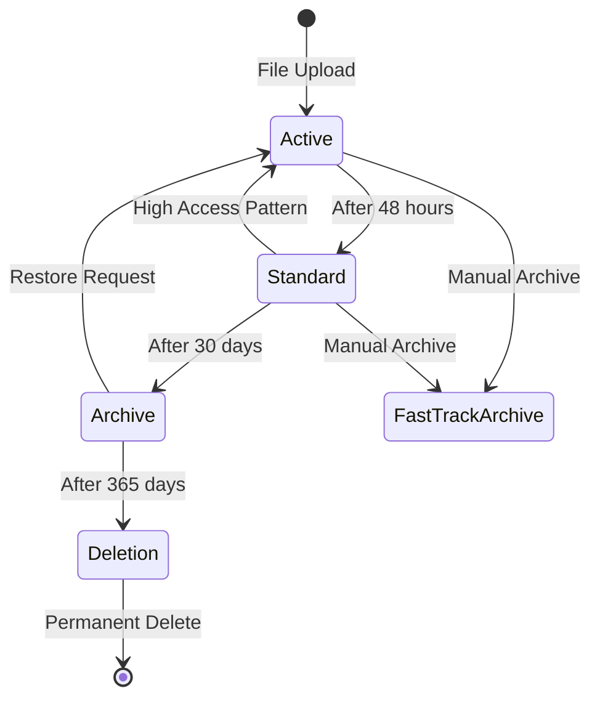

# 📊 Data Lifecycle Management for Honey Reserve

## Overview

This document defines the complete data lifecycle for files stored in STING's Honey Reserve system, from upload through retention, archival, and eventual deletion. Our lifecycle management ensures optimal storage utilization, regulatory compliance, and data availability.

## Data Lifecycle Stages

### 1. 🆕 Active Stage (0-48 hours)
- **Status**: Hot storage, immediate access
- **Location**: Primary storage (SSD)
- **Performance**: Full read/write speed
- **Backup**: Real-time replication
- **Use Case**: Recently uploaded files, active editing

### 2. 📁 Standard Stage (2-30 days)
- **Status**: Warm storage, standard access
- **Location**: Primary storage (HDD)
- **Performance**: Standard read speed
- **Backup**: Hourly snapshots
- **Use Case**: Regular access, reference documents

### 3. 🗄️ Archive Stage (30-365 days)
- **Status**: Cold storage, delayed access
- **Location**: Archive storage (Glacier/Tape)
- **Performance**: 4-12 hour retrieval
- **Backup**: Weekly verification
- **Use Case**: Compliance, historical records

### 4. 🗑️ Deletion Stage (>365 days)
- **Status**: Scheduled for deletion
- **Location**: Deletion queue
- **Performance**: N/A
- **Backup**: Final archive before deletion
- **Use Case**: End of retention period

## Lifecycle Transitions



## Retention Policies by File Type

### Default Retention Matrix

| File Type | Active | Standard | Archive | Total Retention | Auto-Delete |
|-----------|--------|----------|---------|-----------------|-------------|
| Temporary Uploads | 48h | - | - | 48 hours | Yes |
| Chat Context | 7d | 23d | - | 30 days | Yes |
| Generated Reports | 7d | 23d | 335d | 365 days | No |
| Honey Jar Documents | 30d | 60d | 275d | 365 days | No |
| User Uploads | 30d | 90d | 245d | 365 days | No |
| Audit Logs | 90d | 365d | 730d | 3 years | No |
| Backups | 7d | 30d | 328d | 365 days | Yes |

### Custom Retention Rules

Organizations can define custom retention policies:

```yaml
custom_retention:
  financial_documents:
    active_days: 90
    standard_days: 365
    archive_days: 2190  # 7 years total
    auto_delete: false
    compliance: "SOX"
    
  medical_records:
    active_days: 180
    standard_days: 730
    archive_days: 1460  # 6 years total
    auto_delete: false
    compliance: "HIPAA"
    
  temporary_analysis:
    active_days: 1
    standard_days: 0
    archive_days: 0
    auto_delete: true
    compliance: "None"
```

## Automated Lifecycle Actions

### Daily Processing (1 AM UTC)

```python
def daily_lifecycle_processing():
    """Execute daily lifecycle transitions"""
    
    # 1. Transition Active → Standard
    transition_to_standard(age_days=2)
    
    # 2. Transition Standard → Archive
    transition_to_archive(age_days=30)
    
    # 3. Process deletions
    process_scheduled_deletions()
    
    # 4. Apply custom policies
    apply_custom_retention_policies()
    
    # 5. Generate compliance reports
    generate_retention_compliance_report()
```

### Transition Criteria

Files transition based on multiple factors:

1. **Age-based**: Primary trigger (days since creation/modification)
2. **Access-based**: High-access files stay in faster tiers
3. **Size-based**: Large files archive faster
4. **Type-based**: Different rules per file type
5. **User-based**: Premium users get extended active storage

## Access Pattern Monitoring

### Heat Map Tracking

```sql
-- Track file access patterns
CREATE TABLE file_access_log (
    file_id UUID,
    user_id UUID,
    access_time TIMESTAMP,
    access_type VARCHAR(20),  -- 'read', 'write', 'download'
    duration_ms INTEGER
);

-- Calculate access heat score
WITH access_stats AS (
    SELECT 
        file_id,
        COUNT(*) as access_count,
        MAX(access_time) as last_access,
        AVG(duration_ms) as avg_duration
    FROM file_access_log
    WHERE access_time > NOW() - INTERVAL '30 days'
    GROUP BY file_id
)
SELECT 
    f.id,
    f.filename,
    COALESCE(a.access_count, 0) as recent_accesses,
    CASE 
        WHEN a.access_count > 100 THEN 'hot'
        WHEN a.access_count > 10 THEN 'warm'
        ELSE 'cold'
    END as heat_level
FROM user_files f
LEFT JOIN access_stats a ON f.id = a.file_id;
```

### Smart Tier Adjustment

Files with high access patterns can be promoted:

```python
def adjust_storage_tier(file_id: str):
    """Promote/demote file based on access patterns"""
    
    heat_score = calculate_heat_score(file_id)
    current_tier = get_current_tier(file_id)
    
    if heat_score > 0.8 and current_tier != 'active':
        promote_to_active(file_id)
    elif heat_score < 0.2 and current_tier == 'active':
        demote_to_standard(file_id)
```

## Compliance and Legal Holds

### Legal Hold Implementation

```python
class LegalHold:
    """Manage legal holds on files"""
    
    def apply_hold(self, file_ids: List[str], case_id: str, 
                   expiration: Optional[datetime] = None):
        """Apply legal hold to prevent deletion"""
        
        for file_id in file_ids:
            # Mark file with legal hold
            self.db.execute("""
                UPDATE user_files 
                SET legal_hold = TRUE,
                    legal_hold_case_id = %s,
                    legal_hold_expiration = %s,
                    deletion_blocked = TRUE
                WHERE id = %s
            """, (case_id, expiration, file_id))
            
            # Log legal hold application
            self.audit_log.record({
                'action': 'legal_hold_applied',
                'file_id': file_id,
                'case_id': case_id,
                'applied_by': current_user_id,
                'timestamp': datetime.utcnow()
            })
```

### Compliance Reporting

Monthly compliance reports include:

1. **Retention Compliance**
   - Files meeting retention requirements
   - Premature deletions (if any)
   - Extended retentions and reasons

2. **Legal Hold Status**
   - Active legal holds
   - Expired holds pending review
   - Files affected by holds

3. **Regulatory Compliance**
   - GDPR data subject requests
   - HIPAA retention compliance
   - SOX financial document retention

## User-Initiated Actions

### Manual Archive Request

Users can manually archive files:

```python
@api.post("/files/{file_id}/archive")
async def manual_archive(file_id: str, user_id: str):
    """Allow user to manually archive a file"""
    
    # Verify ownership
    if not await verify_file_ownership(file_id, user_id):
        raise PermissionError("Not authorized")
    
    # Check if archivable
    file_info = await get_file_info(file_id)
    if file_info.size < 10 * 1024 * 1024:  # 10MB
        raise ValueError("Files under 10MB should remain in active storage")
    
    # Schedule for archive
    await schedule_archive(file_id, priority='user_requested')
    
    return {"status": "scheduled", "estimated_time": "24 hours"}
```

### Restore from Archive

```python
@api.post("/files/{file_id}/restore")
async def restore_from_archive(file_id: str, user_id: str):
    """Restore an archived file"""
    
    # Check permissions
    if not await can_access_file(file_id, user_id):
        raise PermissionError("Not authorized")
    
    # Check current status
    file_info = await get_file_info(file_id)
    if file_info.storage_tier != 'archive':
        return {"status": "already_active"}
    
    # Initiate restore
    restore_job = await initiate_restore(file_id)
    
    return {
        "job_id": restore_job.id,
        "estimated_time": "4-12 hours",
        "notification_method": "email"
    }
```

## Storage Cost Optimization

### Tier Pricing Model

| Storage Tier | Cost/GB/Month | Access Cost | Retrieval Time |
|--------------|---------------|-------------|----------------|
| Active (SSD) | $0.10 | Free | Instant |
| Standard (HDD) | $0.023 | Free | Instant |
| Archive (Glacier) | $0.004 | $0.01/GB | 4-12 hours |

### Cost Calculation

```python
def calculate_storage_costs(user_id: str) -> Dict:
    """Calculate monthly storage costs for user"""
    
    usage = get_storage_usage_by_tier(user_id)
    
    costs = {
        'active': usage['active_gb'] * 0.10,
        'standard': usage['standard_gb'] * 0.023,
        'archive': usage['archive_gb'] * 0.004,
        'retrieval': usage['monthly_retrievals_gb'] * 0.01
    }
    
    costs['total'] = sum(costs.values())
    costs['potential_savings'] = calculate_optimization_savings(usage)
    
    return costs
```

## Monitoring and Alerts

### Key Metrics

```yaml
lifecycle_metrics:
  transitions:
    - active_to_standard_daily
    - standard_to_archive_daily
    - archive_to_deletion_daily
    
  storage_distribution:
    - percent_in_active
    - percent_in_standard
    - percent_in_archive
    
  compliance:
    - files_meeting_retention
    - files_under_legal_hold
    - overdue_deletions
    
  performance:
    - average_transition_time
    - failed_transitions
    - restore_request_time
```

### Alert Thresholds

| Metric | Warning | Critical |
|--------|---------|----------|
| Failed Transitions | >5% | >10% |
| Overdue Deletions | >100 files | >1000 files |
| Archive Restore Time | >12 hours | >24 hours |
| Storage Tier Imbalance | >80% in one tier | >90% in one tier |

## Data Deletion Process

### Secure Deletion Workflow

```python
def secure_delete_file(file_id: str):
    """Securely delete a file and all traces"""
    
    # 1. Verify deletion eligibility
    if not can_delete(file_id):
        raise ValueError("File cannot be deleted due to retention policy")
    
    # 2. Create deletion certificate
    cert = create_deletion_certificate(file_id)
    
    # 3. Delete from all storage tiers
    delete_from_active_storage(file_id)
    delete_from_archive(file_id)
    delete_from_backups(file_id)
    
    # 4. Overwrite storage sectors
    secure_overwrite(file_id, passes=3)
    
    # 5. Remove database records
    remove_database_records(file_id)
    
    # 6. Log deletion
    log_deletion(file_id, cert)
    
    return cert
```

### Deletion Certificate

Each deletion generates a certificate:

```json
{
  "certificate_id": "del_cert_123456",
  "file_id": "file_789",
  "deletion_timestamp": "2024-01-15T10:30:00Z",
  "deletion_method": "secure_overwrite_3pass",
  "verification": {
    "storage_cleared": true,
    "database_cleared": true,
    "backups_cleared": true,
    "checksum_verified": true
  },
  "authorized_by": "retention_policy",
  "compliance_notes": "GDPR Article 17 compliance"
}
```

## Future Enhancements

### Planned Features

1. **AI-Powered Lifecycle Optimization**
   - Predict access patterns
   - Suggest optimal tier placement
   - Automated cost optimization

2. **Blockchain Audit Trail**
   - Immutable deletion records
   - Compliance verification
   - Chain of custody tracking

3. **Multi-Cloud Tiering**
   - Distribute archives across providers
   - Cost arbitrage optimization
   - Geo-redundancy options

4. **Real-time Analytics**
   - Live tier distribution
   - Cost tracking dashboard
   - Predictive storage planning

---

*Effective data lifecycle management ensures optimal performance, cost efficiency, and regulatory compliance throughout your data's journey in STING.*